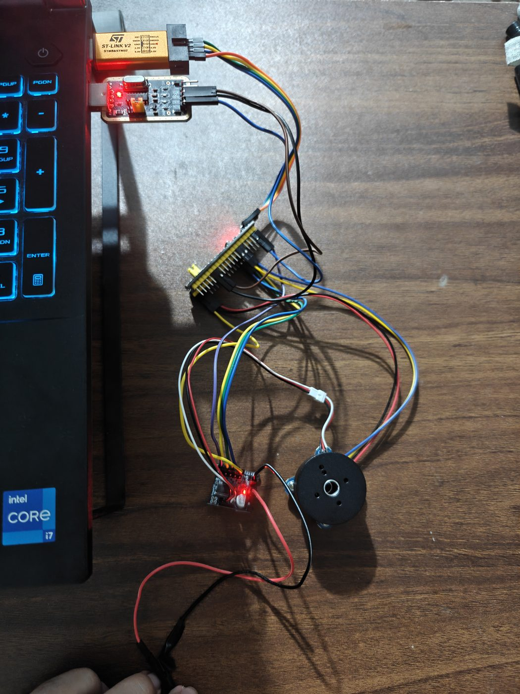

<div align="center">

[简体中文](./README.md) · **English**

</div>

# STM32 Motor Control Learning Project (From Brushed DC to BLDC FOC)

A complete motor control learning project based on STM32F103C8T6, covering **brushed DC motor PWM speed control** to **brushless DC motor (BLDC) FOC control**, culminating in a **force feedback knob**.

> A from-scratch embedded motor control learning record with complete code, detailed comments, and full reproducibility.

---

## 📖 Project Overview

| Project | Motor Type | Environment | Core Technology | Status |
|---|---|---|---|---|
| [1. Brushed DC Motor](./1-Brushed-DC-Motor/) | Brushed DC | Keil MDK | PWM + H-Bridge | ✅ Done |
| [2. BLDC SimpleFOC](./2-BLDC-SimpleFOC/) | Brushless BLDC | Arduino IDE | FOC Field Oriented Control | ✅ Done |
| [3. Force Feedback Knob](./3-Force-Feedback-Knob/) | Brushless BLDC | Arduino IDE | Torque Control + PID | ✅ Done |

---

## 🛠 Hardware List

| Hardware | Model | Purpose |
|---|---|---|
| MCU | STM32F103C8T6 (Blue Pill) | All projects |
| Brushed Motor | TT Motor (dual-shaft 1:48) | Project 1 |
| Brushed Driver | L298N dual H-Bridge | Project 1 |
| BLDC Motor | 2804 gimbal motor + AS5600 encoder | Project 2, 3 |
| BLDC Driver | SimpleFOC Mini (DRV8313) | Project 2, 3 |
| Power Supply | 12V 2A adapter | BLDC power |
| Debug Tools | ST-Link + USB-to-TTL | Flashing + Serial |

---

## 🎯 Learning Path

```
Brushed DC Motor (Beginner)
    ├── PWM speed control
    ├── H-Bridge direction control
    └── Serial command control
          ↓
BLDC SimpleFOC (Intermediate)
    ├── FOC field oriented control
    ├── Open/closed-loop velocity control
    ├── Position control (PID)
    └── Torque control
          ↓
Force Feedback Knob (Final Project)
    └── Spring feel implementation
```

---

## 🔌 Wiring

### Brushed DC Motor (Project 1)

| STM32 | L298N |
|---|---|
| PA0 | ENA |
| PA1 | ENB |
| PB0 | IN1 |
| PB1 | IN2 |
| PB10 | IN3 |
| PB11 | IN4 |

### BLDC Motor (Project 2, 3)

| STM32 | Module |
|---|---|
| PA0 / PA1 / PA2 | SimpleFOC Mini 3-phase PWM |
| PB9 | SimpleFOC Mini EN |
| PB7 / PB6 | AS5600 SDA / SCL |
| PA9 / PA10 | Serial TX / RX |

> Detailed wiring diagram: [docs/images](./docs/images/)

---

## 📦 Directory Structure

```
STM32-Motor-Control/
├── 1-Brushed-DC-Motor/     # Brushed DC (Keil)
│   ├── firmware/User/       # Source code
│   └── README.md
├── 2-BLDC-SimpleFOC/        # BLDC (Arduino)
│   ├── SimpleFOC_2804.ino
│   └── README.md
├── 3-Force-Feedback-Knob/   # Force feedback knob
│   ├── ForceFeedbackKnob.ino
│   └── README.md
├── docs/
│   ├── images/              # Wiring images
│   └── videos/              # Demo videos
└── README.md
```

---

## 📹 Demonstration

### Hardware Wiring



### Demo Video

<video width="640" controls>
  <source src="docs/videos/demo.mp4" type="video/mp4">
  Your browser does not support video playback. <a href="docs/videos/demo.mp4">Download here</a>
</video>

---

## 📝 Usage

### Environment Setup

- **Brushed DC Motor**: Keil MDK-ARM v5 + STM32F1xx_DFP pack (enable MicroLIB)
- **BLDC Motor**: Arduino IDE + STM32duino board package + SimpleFOC library

### Quick Start

Each sub-project has its own README with detailed wiring, build, and flashing instructions.

---

## 📚 References

- [SimpleFOC Documentation](https://docs.simplefoc.com/)
- [STM32duino](https://github.com/stm32duino/Arduino_Core_STM32)
